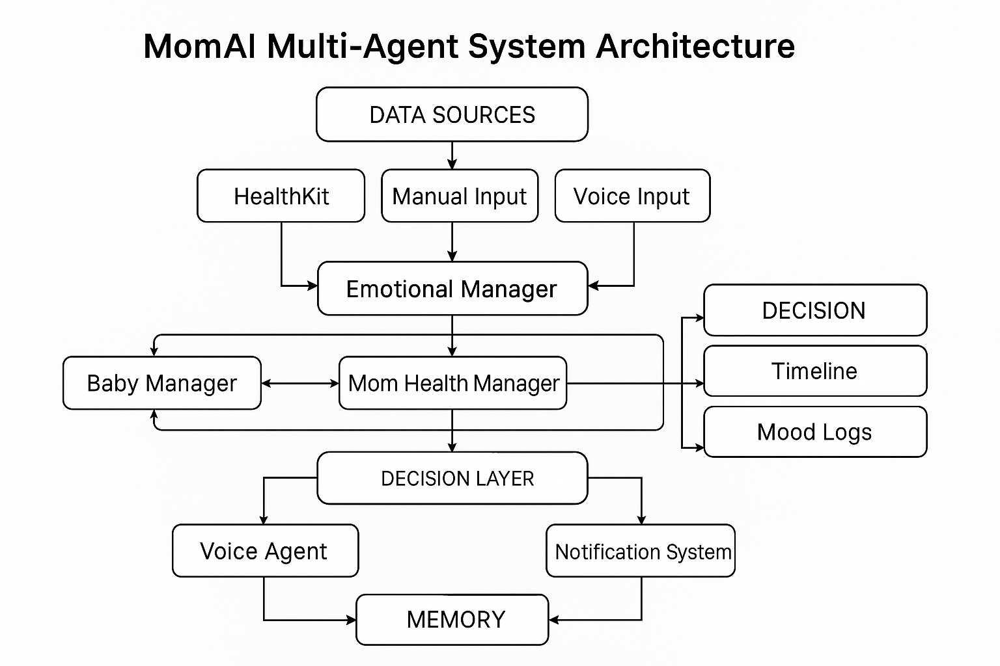

# MOM AI Agent

> _Motherhood isn't a job — but it still deserves support._
> It’s emotional labor. Mental exhaustion. A hundred tiny crises you handle alone.

I'm an Automation Engineer. I'm a mom of two.
I know how lonely it feels to hold it all together — feedings, diapers, crying fits, medical charts, career pressure — with no real support.

Even after reclaiming my health, I realized:
Moms don't need more advice. We need real, intelligent support.
We need to be seen, not judged. Supported, not left alone.

---

## 🚨 The Problem

Every new mom juggles an avalanche of tasks: feeding, diapers, naps, doctor visits, emotional highs and lows.
1 in 7 mothers experiences postpartum depression.
60% of new families have both parents working.
MOM is the most important role — and the most underestimated.
Don’t underestimate the work of a mom.
Let’s build tools that truly respect it. And a community where mom help each other

---

## 💡 The Solution: MOM AI Agent

MomAI Agent is not just a baby tracker.It’s not just a health app.
**It's an emotional companion. A personal support team. A gentle community**

Built by a mother, for mothers.
Powered by six specialized AI agents working together.

📈 Mom Health Manager: HRV, stress, sleep tracking. Period tracking. Gentle health nudges.
🍼 Baby Manager: Feeding, diaper, sleep logs. Cry detection.
🧠 Emotional Manager: Mood tracking, emotional check-ins, soft nudges for mental health.
📋 Task Manager: Daily parenting + home tasks, smart priority reminders.
🗣️ Chat Agent: Real-time Q&A, personalized based on your and your baby's data.
🎙️ Voice Interaction (coming soon): Hands-free emotional support.

✨ New Life Features
📚 Timeline Story: Watch your motherhood journey unfold — tiny milestones, tender moments, everyday victories.
🏡 Family Events Nearby: Discover family-friendly events around you — no endless searching.
👭 Mom Community (Future): Connect, share, and gently support each other. Not competition — real companionship.

**Our vision**:\
A future where no mom feels alone or overwhelmed, where technology anticipates her needs and offers real support — intelligently, gently, and holistically.

> **AI is ready. Moms are not okay.**\
> **The moment is now — and we must move fast.**

---

## 📦 Tech Stack

| Layer        | Technology                       |
| ------------ | -------------------------------- |
| Frontend     | React Native (Expo)              |
| Backend      | FastAPI (Python)                 |
| Database     | Supabase (PostgreSQL)            |
| AI Framework | LangGraph / LangChain agents     |
| AI Models    | DeepSeek, GPT-4                  |
| Device Sync  | Apple HealthKit (future roadmap) |

---

## 📂 Folder Structure

```
MOM AI Agent/
├── Backend/                  # Python FastAPI backend
│   ├── agents/               # AI agent implementations
│   │   ├── babymanager/      # Baby manager agent components
│   │   ├── emotionmanager/   # Emotion tracking agent components
│   │   ├── mommanager/       # Mom health agent components
│   │   └── taskmanager/      # Task management agent components
│   ├── api/                  # API endpoints
│   ├── core/                 # Core functionality (auth, database)
│   └── utils/                # Utility functions
├── FrontEnd/                 # React Native frontend
│   ├── assets/               # Images and static assets
│   ├── components/           # Reusable UI components
│   ├── screens/              # Application screens
│   ├── services/             # API services and hooks
│   ├── src/                  # Core functionality
│   ├── styles/               # Styling
│   └── utils/                # Utility functions
└── supabase/                 # Supabase database migrations
    └── migrations/           # SQL migration files
```

## ⚙️ Setup & Installation

### Prerequisites

- Node.js 16+ and npm
- Python 3.8+
- Supabase account and project
- OpenAI API key

### Backend Setup

1. **Clone the repository:**

   ```bash
   git clone https://github.com/MingHacker/MOMAIAgentNew.git
   cd MOM-AI-Agent
   ```

2. **Install Python dependencies:**

   ```bash
   cd Backend
   pip install -r requirements.txt
   ```

3. **Configure environment variables:**
   Create a `.env` file in the Backend directory with:

   ```
   SUPABASE_URL=your_supabase_project_url
   SUPABASE_KEY=your_supabase_anon_key
   OPENAI_API_KEY=your_openai_api_key
   ```

4. **Run the backend server:**
   ```bash
   uvicorn main:app --reload --host 0.0.0.0 --port 8000
   ```

### Frontend Setup

1. **Install JavaScript dependencies:**

   ```bash
   cd FrontEnd
   npm install
   ```

2. **Configure environment variables:**
   Create a `.env` file in the FrontEnd directory with:

   ```
   EXPO_PUBLIC_API_URL=http://localhost:8000
   EXPO_PUBLIC_SUPABASE_URL=your_supabase_project_url
   EXPO_PUBLIC_SUPABASE_ANON_KEY=your_supabase_anon_key
   ```

3. **Run the frontend application:**
   ```bash
   npx expo start
   ```

## 📊 AI Agent Architecture

The MOM AI Agent system uses a multi-agent architecture powered by LangGraph and LangChain. Each agent is responsible for a specific domain and works together to provide a comprehensive support system for mothers.

### Agent Components



1. **Baby Manager Agent**

   - Tracks baby activities (feeding, diaper, sleep, crying)
   - Analyzes patterns and generates reminders
   - Provides insights on baby's development

2. **Mom Health Agent**

   - Monitors mom's health metrics (HRV, sleep, steps, etc.)
   - Analyzes physical and emotional recovery status
   - Provides personalized health recommendations

3. **Emotion Companion Agent**

   - Tracks mood and stress levels
   - Provides emotional support and encouragement
   - Generates empathetic responses based on health data

4. **Task Manager Agent**
   - Creates and prioritizes parenting and home tasks
   - Sends reminders for important activities
   - Helps manage the daily workload

### Agent Implementation

Each agent follows a similar structure:

- **Graph**: Defines the workflow and connections between steps
- **Schema**: Defines the data structure and state management
- **Steps**: Implements the individual processing steps
- **Prompts**: Contains the LLM prompts for AI interactions

The agents use LangGraph for orchestration, allowing for complex workflows with conditional logic and state management. They interact with the Supabase database to store and retrieve data, and use OpenAI's GPT models for natural language processing and generation.

## 🔥 Innovation Highlights

- Multi-agent orchestration (baby + mom + tasks + emotions)
- Emotional companion for moms — not just task tracking
- Human-in-the-loop design: moms can edit tasks and emotional reports
- Health + emotional intelligence + productivity in one AI-native app

---

## 🤖 Responsible AI Principles

- Human-centered design
- Full transparency on data tracking (opt-in HealthKit sync)
- Emotional support avoids diagnosis and maintains privacy
- Clear boundaries between advisory and decision-making

---

## 🛃️ Future Improvements

- Baby cry sound detection (using Apple Watch/phone mic)
- Toddler growth activity tracking
- Group emotional summaries across parenting communities

---

## 🧑‍💻 Contributors

- Built with ❤️ by Cathleen Lin & Ming Ma
- Contact: [[cathleenlin0330@gmail.com](mailto:cathleenlin0330@gmail.com)]

---

## 📜 License

This project is licensed under the MIT License.

---

# ✨ MOM AI Agent: Building Relief, Not Just Tools.

---

[ HealthKit ]
|
v
[ Mom Health Manager ]
|
v
[ Emotional Manager ] <--- [ Baby Manager ] <--- [ Baby Logs ]

       |
       v

+----------------------+
| Decision Layer |
| (Task Manager + |
| Chat Agent) |
+----------------------+
|
v
+----------------------+
| Action Layer |
| (Notification + Chat + Voice) |
+----------------------+
|
v
[ User Feedback ] --> back to --> [ Emotional Manager ]
